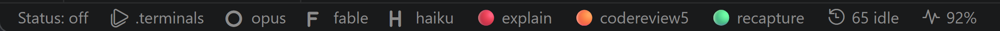
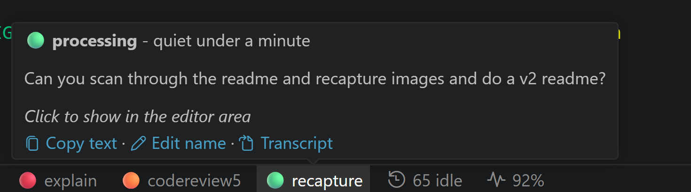
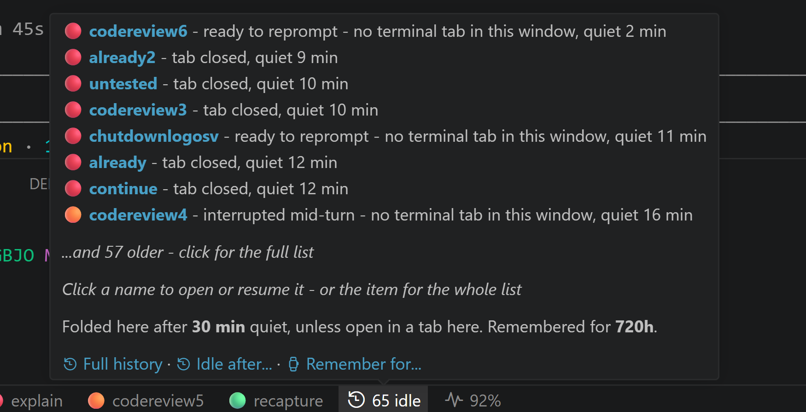
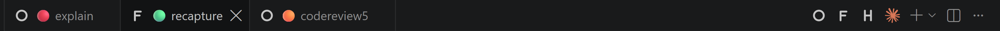
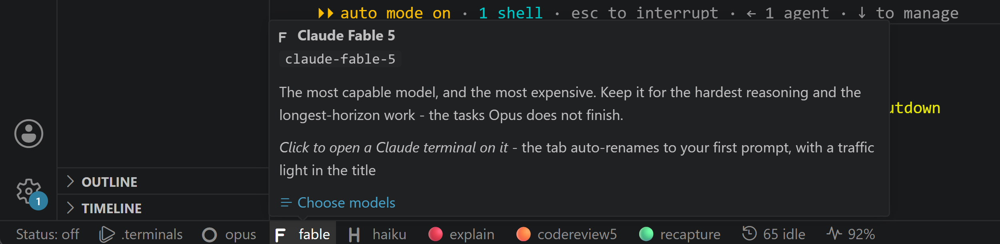
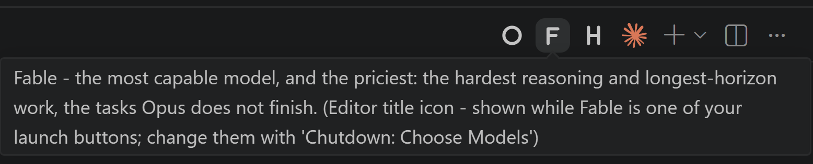
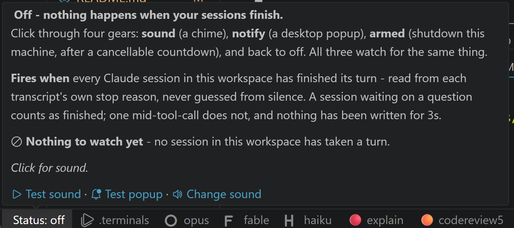
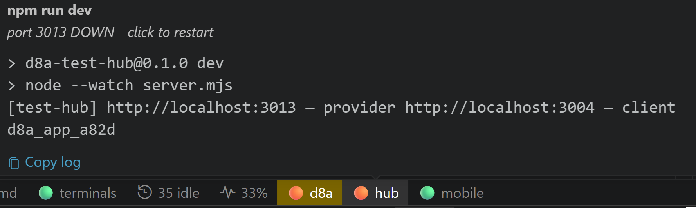
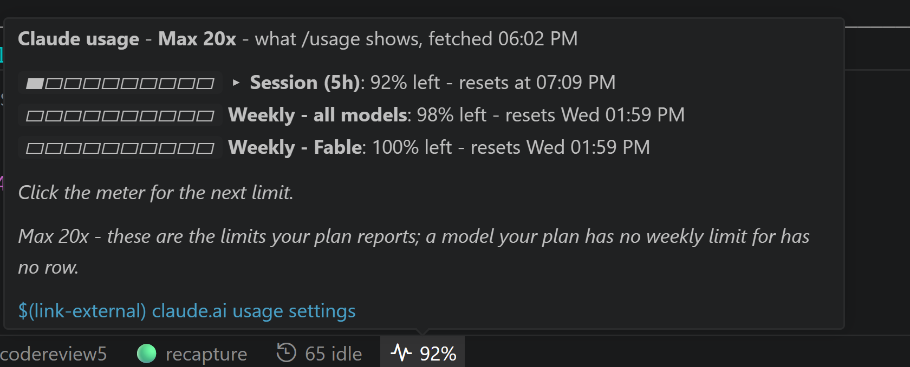

# Chutdown — the manual

Every feature in full detail; the [README](../README.md) is the short, visual tour.

**Windows, macOS and Linux.** Everything below works on all three; the handful of calls
that differ — the chime, the notify popup, the countdown window, the power action,
listing processes, freeing a port, the shell that runs `claude`, and where the usage
meter finds Claude Code's sign-in — live behind one contract in `src/platform/`. See
[Windows, macOS and Linux](#windows-macos-and-linux) for the table, for the rule that
decides what a platform is allowed to *offer*, and for the two differences that are not
just spelling: the macOS power action needs an **Automation** grant the other two do not,
and macOS keeps the usage meter's sign-in in the **login Keychain** rather than in a file.

Anything that is none of those three — a BSD, a Solaris, whatever runs VS Code next —
still gets the lights, the tabs, the batch terminals, the port probe, the usage meter,
the chime, the popup and the countdown window. What it does not get is the **power
action**, and the armed gear says so at the click rather than counting down to nothing.

**Contents:**
[Traffic lights](#traffic-lights--one-clickable-entry-per-session) ·
[Launch buttons](#claude-tabs-with-renamed-titles--the-launch-buttons) ·
[Status: off / sound / notify / shutdown](#power-status-off--sound--notify--shutdown) ·
[How it knows everything is finished](#how-it-knows-everything-is-finished) ·
[.terminals](#run-all-terminals--batch-terminals) ·
[Windows, macOS and Linux](#windows-macos-and-linux) ·
[Usage meter](#pulse-52--claude-usage-meter) ·
[Why the hovers hold still](#why-the-hovers-hold-still) ·
[How it's put together](#how-its-put-together) ·
[Smoke suite](#npm-test--the-smoke-suite) ·
[Install](#install)

Everything lives in the **status bar** (bottom tray):



*Left to right: the shutdown toggle, the `.terminals` button, one launch button per
model, a traffic light per live session, the idle dropdown, and the usage meter. Every
section below is one of those entries.*

## Traffic lights — one clickable entry per session

Every LIVE Claude session whose working directory is inside the current workspace gets
its OWN status bar entry: `🟢 web`, `🟠 fix`, … 🟢/🟠/🔴 (and ⚪ for live sessions with
no tab in this window) show in the status bar — unknown-state sessions stay reachable
through the *Chutdown: Sessions & Terminals* dropdown, and any session quiet longer than
`staleMinutes` (default **30**) — unless a tab in this window is running it, which keeps
its light however long it sits — folds into a single **`$(history) n idle`** dropdown entry:
click it to list the idle sessions and jump to one, or click a name right in its hover to
open or resume that one directly. **Click a light and that session's terminal comes to
the front in the main editor area** — and if it has no terminal tab
in this window, a fresh terminal opens and resumes it (`claude --resume`) right away,
no popup. Hover shows the state, the latest assistant output, and — in the footer, above
the *Click to show…* line — **First** and **Latest**: the prompt the session was started
on and the most recent one you sent it. Those collapse to a single unlabelled line while
a session is still on its opening prompt.
Closing a claude tab — or clicking **✕ Close** in a light's hover — retires its light
and drops the session into the **idle** dropdown immediately, however young; the
dismissal survives a reload, and new transcript activity (resuming it) promotes it
back to a live light.



*Hover a light and you know whether that session needs you — its state, how long it
has been quiet, the latest answer, the prompt that started it and the one you last sent — without focusing
its terminal.*

### When the bar is full

A busy afternoon is four launch buttons, a dozen session lights and three dev servers,
and the status bar is one line with no scroll: VS Code drops whatever does not fit,
rightmost first — which is the idle entry, the usage meter and the batch lights. Rather
than lose them, the three things that grow (the launch buttons, the session lights, the
batch terminal lights) **compact together, in steps, once they are estimated to pass
`chutdown.statusBarBudget`** (default **120**, roughly in characters):

| step | launch buttons | session lights | batch lights |
| --- | --- | --- | --- |
| full | **O** opus | 🟢 recapture | 🟢 backstop |
| letters | **O** | 🟢 recapture | 🟢 backstop |
| short | **O** | 🟢 recaptu… | 🟢 backsto… |
| shorter | **O** | 🟢 reca… | 🟢 back… |
| lights | **O** | 🟢 | 🟢 back… |
| bare | **O** | 🟢 | 🟢 |

Buttons lose their words first because the letter already says what they are; the
session lights go bare before the batch lights because there are usually more of them
and a dev server's name is the more useful one to keep. **Whatever a light stops saying,
its hover still says** — a cut or dropped name leads the hover in bold. The level is
settled once per poll, before any light is painted, so one render never shows two levels,
and the buttons and batch lights move in the same poll as the session lights; as the
crowd thins it steps back up. The extension API has no way to read the bar's real width,
so the budget is an estimate: raise it on a wide screen, lower it on a laptop, **0 =
never compact**, 1 = always as compact as it gets. A move is logged in the *Chutdown*
output channel (`density: full -> letters …`).

**Names** start by SCANNING the whole first prompt for its distinctive words — stopwords
and generic verbs ("the", "can", "fix"…) are skipped and the survivors are ranked
longest first — so the tab shows a real task word immediately, and the words behind it
are what a collision falls back to (below). Once the session's FIRST TURN
completes (it turns 🟠 or 🔴), a cheap headless Claude call (`claude -p`, haiku by default —
`aiNames` / `aiNamesModel` settings) reads the prompt *and* the assistant's answer and
VERIFIES that word: it keeps it if it fits the task, otherwise replaces it with a better
one-word name, told which names are already taken. Failures retry
once and are logged to the **Chutdown** output channel (View → Output); a `claude` that
cannot be spawned at all stops the namer for the rest of the window rather than being
re-tried once a second, and **toggling either `aiNames` or `aiNamesModel` lifts that
latch** — touching one of them is the gesture of somebody who has just fixed the thing
that broke it, so it no longer takes a window reload. While it thinks you'll see a grey `⚪ verifying <name>…` entry. It runs with
its cwd outside the workspace on purpose — a claude run *inside* the workspace would get
its own traffic light and hold the armed shutdown hostage. Names are cached per session,
so reloads don't re-spend calls.

**No two tabs ever share a name.** Uniqueness is enforced on EVERY name, not just the
AI-verified ones: the scanned placeholder, a name restored from the cache and the AI
word all go through the same check. A second tab wanting a taken word does not simply
get a digit — it takes **the next distinctive word out of its own prompt** ("rewrite the
parser so it keeps comments" becomes `comments` when `parser` is worn), because `review`
beside `review2` is the pair that gets misread at a glance and the digit says nothing
about the task. The counter is the last resort, for a prompt with no free word left in
it. A word somebody *chose* — typed into the hover, `/rename`d in the CLI, or picked by
the verifier — keeps the counter instead: that word was picked for this task, so
swapping it for another is not deduplication. A sweep after each scan settles anything
that still slipped through — two sessions restored side by side wearing the same cached
word, say — always the same way: the OLDER session keeps the bare word, the newer one
moves, so nothing flip-flops between scans. Corrections are written back to the name cache, and
the tab title catches up the next time that terminal is focused.

**Names survive a restart.** A window *reload* keeps the shells alive, so tabs re-attach
to their sessions by process id. QUITTING VS Code — or rebooting the machine — kills the
pty host: every saved pid is stale, and the tab comes back nameless, because the rename
can't be re-attached. It wears the name it was *created* with (plain `claude`), and once
the relaunched shell writes its own title over the top, just the shell's name — with Git
Bash as the default profile, a whole window of restored tabs reads `bash`. So the bindings
are also saved in tab order, with a slot for *every* tab, claude or not: at startup those
slots are lined up with the restored tabs and the names go back on by position
(`restoreTabNames`, on by default). A session that has aged out of
`lookbackHours` gets the exact title it wore at quit time. Those tabs are empty shells — the
pty host died with the app, and what VS Code relaunched is a fresh shell — so once the tabs
have settled each session is **resumed automatically** (`autoResume`, on by default). Not
into that restored shell, though: what the workbench relaunched there is whatever it had to
hand at that moment — on a slow cold boot its profile detection may not have found your
default shell yet, so the tab comes up in the OS fallback (Windows PowerShell on a Git Bash
machine), running with the environment saved before the quit rather than today's — and a
`claude --resume` typed into that came back as `claude : The term 'claude' is not
recognized`. So the restored shell is **closed and the session reopened in a terminal of
Chutdown's own in its place**, with everything a claude tab gets: born wearing its session
title (no rename flick), the model letter on the icon, the session's folder, a fresh
environment, and `claude --resume <id>` typed into *that*. It is started in **the shell your
own settings name** — `terminal.integrated.defaultProfile.<os>` read and resolved by
Chutdown (a `path` profile as written; the built-in "Git Bash" looked up where VS Code
looks) rather than left to the workbench's detection, which is what was not ready; where
that cannot be read (no default set, a PowerShell or WSL source) the workbench's default
applies as for any terminal (`revive: reopening in C:\Program Files\Git\bin\bash.exe`). A
panel tab is opened as a split
of the dead one so it keeps its slot in the row; an editor-area tab goes to the active
column. The log line reads `revive: re-bound 3 claude tab(s) by tab slot after a restart -
resumed 3 of them (3 in fresh terminals)`; a tab that could not be reopened is resumed in
place the old way. A claude you opened and never spoke to has a session id but no transcript
(Claude Code writes the file on the first message), and `claude --resume` on it only answers
`No conversation found` — so such a tab gets a plain `claude` instead, paired with the new
transcript like any fresh tab (`revive: 8ab65b76 has no transcript on disk (a claude that was
never spoken to) - opening a fresh claude in its place rather than resuming it`). **A restored
tab you have already typed into, or run something in, is
yours**: the extension loads late on a cold boot and nobody waits at an empty prompt for it,
so such a tab is not paired, not renamed, never closed and never typed into (`revive: 1
restored tab(s) already in use - left alone`) — your own `claude --resume` there is adopted
like any hand-started claude, and a light-click on that session opens a fresh terminal
rather than typing over you. With `autoResume` off the tabs keep their names and clicking a
session's light resumes it **into its tab** rather than opening a second one beside it
(unless you have typed into it since — then a fresh one). A plain window reload never
resumes anything: those shells survive, and their claudes with them.

**Every tab is named at startup, not just the one in front.** Only the *active* terminal can
be renamed — the workbench has no "rename that other tab" command — so once everything that
can be bound is bound (restored slots, pids re-attached after a reload, and the tabs claude's
own pid files identified), the claude tabs are flicked through once: each is revealed in turn
without taking focus, renamed, and the tab you were left looking at goes back in front. Tabs
already wearing the right title are skipped, so a window with nothing to fix does not flicker
at all. Before this, only the tab the window happened to restore in front got its word and the
rest sat there as `claude` or `bash` until they were clicked. Run it again at any time with
**Chutdown: Put Session Names Back On The Tabs** — useful after a background tab's light has
moved on without it, since that title can only catch up when the tab is active.

**Starting up.** Chutdown activates in VS Code's *first* wave (`"*"`), not after startup
has finished. On a cold start — the first window after a reboot — "after startup has
finished" can be a minute away, and until it arrives there are no traffic lights and every
button answers *Activating Extensions…*. Being early is cheap here: activation only creates
status bar items and registers commands, everything else is on a timer. What it does mean is
that the extension is up before the workbench is — no transcripts read yet, often not a
single terminal restored — so the status bar starts with a **spinner** where the lights go.
It stays until both halves have reported in: the first render of the lights, and the one-off
pass over the tabs. That pass waits for the tab set to stop growing rather than running on a
fixed timer (up to a minute), then puts the names back by slot and asks claude's own pid
files which session each still-unbound tab is running — so a tab whose claude was already
running when the window loaded gets its light back at once instead of on the poll's next
gap. If a pass never reports in, a 90-second backstop takes the spinner down anyway.

- 🟢 **processing** — a turn is in flight, or background agents/workflows are writing
- 🟠 **waiting on you** — the CLI is blocked on a prompt of its own: a multiple-choice
  question, a plan approval, a permission prompt. **This one does not come from the
  transcript**, because it cannot: Claude Code writes the `AskUserQuestion` record only
  once you have *answered* it, so while the question is on your screen the newest record
  in the file is still the prompt that led to it — byte-for-byte identical to a turn
  that is still running. It came from Claude Code's own
  `~/.claude/sessions/<pid>.json`, which carries `status: "busy" | "waiting" | "idle"`.
  `waiting` is the one the transcript never shows, and without it a session sitting on a
  question read as 🟢 **processing** and held the armed shutdown open as if it were work
  in flight
- 🟠 **asking a question** — the same thing inferred from the transcript after the fact,
  or a reply that ends in "?" (this is what you get for a session with no status file —
  an older CLI, or one running on another machine)
- 🟠 **interrupted** — the last turn was cut short: Escape (the transcript ends in
  `[Request interrupted by user]`), or the process died mid-turn with a tool call
  still pending. Nothing is running; reply to carry on
- 🟠 **no reply to the last prompt** — a prompt went in and nothing came back for
  `noReplyMinutes` (default 5). Cancelling a prompt in the first moments — Escape or
  Ctrl+C *before* the first token — writes NO `[Request interrupted by user]` marker,
  so on the page it is indistinguishable from an answer that is merely slow; time is
  the only thing that separates them. Across 1320 answered prompts on this machine the
  slowest first response took 5 minutes, so the light waits that long before giving up.
  The sound and the armed shutdown wait twice as long again before they stop counting
  it as work — a wrong light costs nothing, a wrong shutdown does not undo
- 🔴 **ready to reprompt** — the turn is done, nothing is being asked; send the next
  prompt whenever
- ⚪ **running in another window** — no terminal tab here, but the transcript is still
  being written, so some other window holds it. This lasts only as long as
  `orphanMinutes` (default 2) past the last write: after that the transcript decides
  the colour instead — 🟠 interrupted or 🔴 finished. That is a *display* rule, and
  two minutes of silence does not actually prove nothing is running it (a long tool
  call writes nothing) — which is why the sound and the armed shutdown do **not** use
  this threshold; they wait 15 minutes. The state that genuinely can't be read stays
  ⚪ unknown in the dropdown

### After a reload or a restart

**Only what was actually open comes back.** On the first scan of a new window, a light
is restored only for a session that still HAD a claude tab when the window last saved
its bindings. Every other session in the lookback window — closed on purpose, closed
in another window, or just old — starts in the **idle** dropdown instead, so a reload
no longer brings back a light for everything touched in the last few hours. Sessions
still being written (something else is running them) are exempt and keep their light.

Nothing is lost: idle sessions are one click away in the `$(history) n idle` dropdown,
and any new transcript activity — including resuming one — promotes it straight back
to a light.

**It stays readable at forty.** A day's work is dozens of idle sessions, so the hover
shows the **newest eight** and says how many older ones it left out, rather than growing
taller than the screen. Clicking through opens the full list **grouped by age** — *Last
hour*, *Last few hours*, *Earlier today*, *Older* — because "where did that session go" is
nearly always answered by *roughly when*, and that turns forty rows into five. Typing
filters on the session name, its first prompt **and** its folder. At the bottom sits
**$(clear-all) Forget all N idle sessions**, which is the only thing that actually
shortens the list rather than paging through it: everything in it is idle by definition,
nothing is deleted, and any of them comes straight back the moment it is resumed or
written to again.

**Both numbers are editable from the idle entry itself.** Its hover states them —
*"Folded here after 30 min quiet, unless open in a tab here. Remembered for 24h."* — and
carries **$(clock) Idle after…** and **$(watch) Remember for…** links, because those two
settings are the sort you only think about while looking at this entry: *why has that
folded away already*, *where did yesterday's session go*. Each opens a short pick list
with the current value ticked (and a Custom option), and writes into whichever scope the
setting is already set in. Defaults: fold after **30 minutes** quiet, remember **24
hours** of history. The same two are in the palette as *Chutdown: Fold Sessions Into Idle
After…* and *Chutdown: How Far Back To Remember Sessions…*.

**$(history) Full history** is the third link, and it opens the *history*, not a setting.
The idle list is by definition the sessions that have gone quiet; the history is
**everything still inside the lookback window — live sessions as well as idle ones** —
newest first, in the same age bands, with the clock time each one last ran in a column of
its own beside how long ago that was, so a day reads down the list as a timeline. Typing
filters on name, time, prompt and folder; picking a row opens or resumes it exactly as
the idle list does. The lookback window has its own row at the bottom (*Remembered for
24h — change…*), which re-opens the list on the new window rather than dropping you back
to the status bar. It is *Chutdown: Session History* in the palette. (That link used to
open the lookback setting — a number of hours, which is the one thing about the history
that is not the history.)

**And it keeps applying.** That rule used to run *once*, on the first scan, with one
exemption: a session written in the last `orphanMinutes` is live in some other window, so
it keeps a light. True at that instant — but nothing re-checked it, so when the other
window finished with that session it settled here as a 🔴 *"ready to reprompt — no
terminal tab in this window"* light, for a session this window had never opened, until
`staleMinutes` finally folded it away an hour later. That is the stray entry that showed
up in the status bar of a freshly opened VS Code.

Now the same test runs on every render: no tab here, **never had one here**, and nothing
writing it any more → the idle dropdown. A session another window is *actively* running
still gets its ⚪ *running in another window* light, because that is what ⚪ is for; it
just no longer inherits a coloured light when that window is done. Nothing is persisted
for this, so new activity promotes it straight back.



*Getting an old session back is one click on its name — no digging through
`claude --resume`'s picker to work out which of thirty session ids was the one about
the schema.* The startup decision is logged to the **Chutdown** output channel
(`startup: n session(s) had a tab, m with none -> idle`), as is every tab close.

This does not rely on catching the tab-close event, which cannot be trusted for it: a
window going away closes its tabs without telling the extension, and a tab that was
never bound to a session has nothing to record. Asking what *was* open is the reliable
half of the question.

A window reload (and a full quit even more so) leaves sessions with no live process
behind them — they used to sit there as a row of white lights saying nothing. Now each
one's transcript is read and the light says how it actually ended: **🟠 interrupted**
or **🔴 finished**. Tabs VS Code restores as empty shells count as "no process" too,
so a session killed mid-turn comes back 🟠 rather than a 🟢 that is not running.

**Getting the text OUT of a hover.** A hover cannot be selected — VS Code offers
extensions no way to make one sticky or selectable outside the editor, so the answer
sitting in it used to be unreachable. Every light's hover therefore carries a
**$(copy) Copy text** link: one click puts that session's whole hover on the clipboard
as plain text — light, state, quiet time, the first and latest prompt, and the latest output —
plus the cwd and session id the hover itself has no room for. Batch terminals have the
same link (**Copy log**), and theirs copies all 40 kept lines, not just the 15 the
hover shows.

**Renaming a session.** The word next to the light is the AI namer's pick, and when it
picked badly the fix is right in the hover: **$(edit) Edit name** opens an input box
pre-filled with the current word (max 14 characters, so it fits a tab title). The name
you type wins for good — it is deduplicated against the other sessions' words, the
tab and light take it over, it survives a window reload, and the AI namer never
second-guesses a name a human chose.

Renaming the **tab itself** works too — double-click the tab, right-click →
*Rename*, F2: the ways VS Code always offered. Instead of stamping over what you
typed, the next poll **adopts** the word as the session's name — deduplicated,
cached, and human-owned exactly like *Edit name* — and puts the traffic light back
in front of it (`🟢 api`). Keep the light in your rename or not, either way the
word is what is taken; only titles a person plausibly typed count, so a shell
writing its cwd or the CLI's spinner line into the title is never mistaken for you.

So does **`/rename` inside Claude Code itself** (and `claude --name`). Every live
CLI writes its session name into the same `~/.claude/sessions/<pid>.json` the lights
already read, and marks the names it made up on its own (`nameSource: "derived"` —
the `chutdown-4f` style — or `"collision"`); a name carrying no such mark is one a
person typed, and the next scan adopts it through the same path: deduplicated,
cached, light back in front. Each `/rename` is adopted **once**, so renaming again
later from the tab or the hover is not fought over — while the next `/rename`, being
a new value, wins again.

Lights you are done with have a way out: hover one and click **✕ Close**, or
**✕ Close all with no tab** to clear the whole post-reload row at once (also in the
*Sessions & Terminals* dropdown, **after** the session rows — a bulk close is not
something to leave sitting under the cursor when the dropdown opens). The same hover
carries **$(go-to-file) Transcript**, which opens the raw `.jsonl` the light is read
from; the light itself opens or resumes the session, which is what you want almost
every time. Closing only retires the light — the
session moves to the **idle** dropdown, nothing is deleted, and picking it there
resumes it. A dismissal **survives a reload**, and it is not spent by Claude Code's
own bookkeeping: the receipt is only cashed when a turn actually moves again, so the
`away_summary` recap that lands three minutes after a turn ends no longer brings the
light back on its own.

`quietMinutes` does not affect the lights, and no longer decides when the shutdown
fires either — that is read from the transcripts (see *How it knows everything is
finished*). It is now just an optional extra hold before the power action, default 0.

Hover shows the state, quiet time and the latest assistant output; click opens the
session — its tab if this window has one, a `claude --resume` if it does not — and the
raw `.jsonl` is the `$(go-to-file) Transcript` link in the hover, a line further down.
Detection reads the transcripts under `~/.claude/projects` — the same state machine as
the desktop app (sidechains ignored, sidecar background work counts as activity).

> API honesty: VS Code gives extensions no way to rename or recolor terminal tabs they
> didn't create, so claude terminals YOU open stay as they are — the traffic lights
> mirror them. Terminals opened through the extension (below) do get renamed tabs.

## Claude tabs with renamed titles — the launch buttons



*Six sessions, six real names — each tab wears its session's traffic light, so the
tab strip reads like the status bar. The letter buttons top right open a new session
on that model.*

Open Claude **through the extension** and its tab is ours to manage:

- a **lettered status bar launch button** — one per `claudeButtons` entry, by
  default `opus`, `fable`, `sonnet` and `haiku` (Opus 5, Fable 5, Sonnet 5 and
  Haiku 4.5). Each wears its model's own mark — the same **O / F / S / H** the editor
  title bar and the terminal tabs draw, shipped a second time as an icon font
  (`media/chutdown.ttf`, built by `media/make-font.js`) because a status bar item takes
  icon *ids*, not SVG files. A hand-typed model outside the catalog has no letter and
  keeps a `$(sparkle)`. Each entry is `label = model`, with the model passed to
  `claude --model`. **The hover says what that model is best used for** — four
  buttons side by side is guesswork otherwise, and the status bar has room for a
  label and nothing else (and on a crowded bar not even that: the labels are the
  first thing to go, leaving the letters — see *When the bar is full* above):

  | button | model | best used for |
  | --- | --- | --- |
  | **O** opus | `claude-opus-5` | the everyday workhorse — complex agentic coding, multi-file features, larger refactors, long autonomous runs |
  | **F** fable | `claude-fable-5` | the most capable model, and the most expensive — the hardest reasoning and longest-horizon work, the tasks Opus does not finish |
  | **S** sonnet | `claude-sonnet-5` | near-Opus quality on coding and agentic work at a fraction of the cost |
  | **H** haiku | `claude-haiku-4-5` | fastest and cheapest — quick edits, renames, lookups, summaries, boilerplate |

  

  *Starting a session on a specific model is one click — no
  `claude --model claude-fable-5` to remember — and the hover answers "which of these
  four do I want?" before you commit a prompt to the expensive one.*

  **The default four are trimmed to the models your account can actually launch.**
  Fable is a Max model unless usage credits are switched on, and a button whose only
  possible answer is *"your plan does not include this model"* is worse than three
  buttons that all work — so on a Pro account with no credits the default list has no
  Fable button, and no **F** icon either. The reading comes from the same place the
  usage meter's numbers do: the plan Claude Code recorded — in its credentials, or in
  `~/.claude.json` where there are no credentials to read, which is the ordinary case on
  a Mac — plus the limit
  windows and credit state the usage endpoint reports. Its **positives are certain and
  its negatives are not** — a weekly limit window for a model proves the account may use
  it, while an unused model's window reads `null` and proves nothing — so the only
  models ever held back are the ones a *plan* gates (today: Fable), and only when
  nothing in the account's usage says otherwise. A plan name this build has never heard
  of, or no plan readable anywhere, means "offer everything".

  A list **you** picked is never second-guessed: tick Fable in the picker on any plan
  and you get a Fable button, with the hover saying once what it will cost you —
  Chutdown reads the account, but the CLI is the authority on what may run. In the
  picker, a model your plan does not include is marked `⚠` and says why; it is still
  tickable.

  To change which models are here, run **"Chutdown: Choose Models"** (or click
  *Choose models* in any button's hover) and tick them: the picker writes
  `claudeButtons` for you, in the fixed catalog order, into whichever settings scope
  already holds the value. Hand-typed entries outside the catalog stay listed and
  stay ticked, so a custom model id is never silently dropped. Editing the setting
  by hand still works exactly as before (an empty list falls back to one plain
  `claude` button with no model pin). The same buttons also sit **top-right in the
  editor title bar**, leftmost in that row (a negative `navigation` order puts them
  ahead of Claude Code's own "open in terminal" icon): the catalog models get the
  letter buttons **O** / **F** / **S** / **H** (`media/letter-*.svg`, one pair per
  letter for the light and dark themes). Menu contributions are static in VS Code, so
  each letter is welded to its model rather than to a position: a slot shows only while
  its own model is one of your buttons (`chutdown.slot1`…`slot4`), so dropping Fable
  leaves a gap where the **F** was instead of sliding Sonnet under it. A hand-typed
  custom model gets a status bar button but no letter icon — there is no letter for it.
  Turn the row off with `editorTitleButtons`.

  

  *The same four buttons where your hands already are, and the same hover on each. One
  click is the whole interaction — none of the round trip of opening a terminal, typing
  `claude --model claude-fable-5`, or `/model` inside a session that has already
  started on the wrong one.*

- the **"claude" profile in the terminal panel's own + dropdown** (no model pin), or
- a `claude` entry in `.terminals`.

The new terminal runs `claude` in the workspace root (the tab carries the launched
model's own letter — the same **O** / **F** / **S** / **H** marks the editor title
buttons wear, `media/letter-{o,f,s,h}-{light,dark}.svg`, so the tab says which model
is running in it. A **resumed** session gets its letter too, read out of the transcript:
every assistant record names the model that wrote it, so the mark follows what the
session has actually been running — a mid-session `/model` switch included — rather than
what it was first launched with. A tab whose model Chutdown cannot know — the + dropdown
profile, a hand-typed custom model, a session nothing has answered in yet — carries the
Chutdown "C" instead, `media/tab-claude-{light,dark}.svg`. The mark is fixed when the
terminal is created and VS Code offers no way to change it afterwards, so it reports what
was *launched*; it survives a window reload and a full restart, because VS Code persists
the icon alongside the tab's title, but a tab **revived** from a quit and resumed back
into its own empty shell keeps whatever mark it came back with)
**as a tab in the main editor area**, not the bottom panel (`openInEditorArea`, default on —
panel-born terminals are moved over the first time you click their light). Once you
send your first prompt, the tab renames itself to `🟢 <a distinctive word from your
first prompt>` — the one-word name described under **Names** above — and the emoji
tracks the traffic light. The title is re-asserted every poll while the tab is active —
the claude CLI writes its own spinner/status into the terminal title and would otherwise
win the tab back — with one exception: a title **you** typed onto the tab (double-click,
F2) is not stamped over but adopted as the session's name, light and all (see *Renaming
a session* above). Extension-created terminals get
`CLAUDE_CODE_DISABLE_TERMINAL_TITLE=1` so claude stops competing at the source. One
honest constraint remains: VS Code can only rename the *active* terminal tab, so
between visits the status bar light is the live one.

**A tab still called `claude` is asked what it is running.** A name is only ever lost
when nothing here knows which session a tab holds — and a claude that was already
running before the window loaded is announced by no event at all, so no amount of
guessing from cwd or tab order finds it. Every live claude CLI writes
`~/.claude/sessions/<pid>.json` (its pid, its sessionId, its cwd) and a tab knows its
shell pid, so the two are joined exactly: the claude process whose ancestors include
that tab's shell pid is that tab's session. The walk goes upwards, never one level —
here it is `claude.exe <- bash <- bash <- the shell VS Code reports`. With the session
id in hand the **name cache** answers the rest, so the tab goes back to the word it
wore in the last window instead of staying `claude`. Headless `claude -p` runs (the AI
namer is one) are skipped, pid reuse is ruled out by comparing process start times, and
a session another tab already holds is never claimed twice. Off with `identifyTabs`: it
lists processes at most once every 15s while a tab is unidentified, and once every 5
minutes when that set stops changing.

**It runs on every platform that can list its processes**, which is all of them —
`Get-CimInstance Win32_Process` on Windows, `ps -A -ww -o pid=,ppid=,lstart=` on macOS,
Linux and the BSDs. It used to be Windows-only, because the listing and the pid-reuse
check were written inline in the module that needed them and were spelled in PowerShell;
both now come from the platform contract, and the gate `identify.js` reads is
`processTableArgv()` returning `null` — *"there is no way to list processes here"* —
rather than a question about which OS this is. Nothing else about the sweep is
per-platform: the same 15s floor, the same 5-minute backoff, the same twelve-hop ancestry
walk. The two gaps are unchanged on the cheaper platforms deliberately — `ps` is tens of
milliseconds against PowerShell's several hundred, but both pace a question whose answer
cannot change until the set of tabs does, and both run on the extension host's one thread.

The start-time comparison that rules out pid reuse is the one genuinely different piece:
Windows compares `CreationDate` FILETIME ticks with a 5-second tolerance, POSIX compares
`ps` `lstart` strings — the same comparator Claude Code itself uses, read as UTC under
`LC_ALL=C` because that is what the session file was written under. A platform that
cannot check answers *"not recycled"* rather than *"no match"*: a wrong guess about a date
format has to degrade to the sessions-file match alone, never to a tab that can never be
identified.

Two macOS cases have no ancestry to walk and fail closed with one line in the output
channel, deliberately un-papered-over: under **tmux or screen** the tab's reported process
is the multiplexer *client* while `claude` runs under the *server*, so the chain is
genuinely broken; and a `claude` whose parent shell died is reparented to `launchd` and
stops descending. Guessing from the working directory instead would claim the wrong
session on any project with two tabs open, which is worse than an unnamed tab.

A tab that never leaves `claude` says why in the **Chutdown** output channel: every tab
tracked (`tracking claude tab in …`), every tab paired with a session (`bound: … -> name`)
and every reason a rename did not happen (`rename: active tab "pwsh" is not a tracked
claude terminal`, `… is not bound to a session yet`) is logged once, and again only when
it changes — so a five-second poll cannot flood it.

## `$(power) Status: off / sound / notify / shutdown`

Four gears, clicked in a cycle — **off → sound → notify → shutdown → off**. All three live
gears watch for the same thing: **every** session in the workspace 🔴.

The item is named **Status** and the *gear* is named after what it will do, so the armed
reading is the power action itself — `Status: shutdown`, or `Status: restart` /
`Status: logoff` / `Status: test` if you have changed `chutdown.action`. That last one
matters: `test` only shows a message, and an item that said "shutdown" over it would be
lying about a gear that powers nothing off.



*You get told the moment the last session finishes — a chime if you're in the room,
a powered-off machine if you've gone to bed — instead of checking back on a wall of
spinners.*

**`$(bell) sound`** is the first of the two harmless middle gears: when the last session finishes it
plays `soundFile`. The sound ships with the extension — `media/chime.wav` — so a fresh
install chimes without depending on what is in `C:\Windows\Media` or
`/System/Library/Sounds`. It is a single struck ping, under a second, and it is
*generated*, not sampled: `node media/make-chime.js` rewrites it from the note, decay
rates and attack at the top of that file, so "softer", "lower", "let it ring longer" —
or a second note, which the comment there shows how to add — is an edit and a re-run.
The chime that shipped before it is still there as `media/chime-classic.wav` — name it
below to have it back.

**You do not have to type a path to change it.** The toggle's hover explains the gear
itself — what this one does, what has to be true before it fires, which sessions are
still holding it back *right now*, and what the next click gets you — and carries three
links along the bottom as a footer: **$(play) Test sound**, **$(bell-dot) Test popup**
and **$(unmute) Change sound**. The sound is a footer and not the subject, because
nobody hovers a power switch to audition a wav; it is there because the moment you
decide you dislike the chime is the moment you are hovering the gear, not the moment
you are in `settings.json`. **Change sound** opens a
picker listing the extension's own `media/` folder (the bundled ping, the classic one,
and anything you drop in there yourself), then *every sound this machine already has* —
all ~70 of `C:\Windows\Media`, or `/System/Library/Sounds` on macOS — and finally
**Browse** for any file anywhere. Every row has a **▶ play button that previews it
without closing the list**, so you audition a shortlist and only then commit; picking
one writes `soundFile` and plays it back. Nothing is copied or converted — the file is
referenced where it lives. The pick is written into whichever scope the setting is
*already* set in, so a workspace-level chime is not silently shadowed by a global write.
The palette has the same thing as `Chutdown: Choose the Finished Sound`. Blank (the default)
means the bundled chime; a **relative** path resolves inside the extension folder, so
dropping your own `.wav` in `media/` and naming it here is all it takes; an
**absolute** path is used as-is (`C:\Windows\Media\chimes.wav`,
`/System/Library/Sounds/Submarine.aiff`, …). A missing file
falls back to the platform's own system sound, and so does a path belonging to the
*other* operating system — a setting travels, through Settings Sync or a dotfiles repo,
and `C:\Windows\Media\chimes.wav` is not an absolute path on a Mac, so it used to be
folded whole (backslashes and all) into one nonexistent filename inside the extension
folder: the chime silently became the system sound while the toggle's hover went on
naming a Windows wav. It is now recognised as foreign, the bundled chime is used, and
the output channel says which value it was. Nothing is stopped and nothing is powered
off. It is
**edge-triggered**: one sound per "everything went quiet" event, then silence until
some session **actually starts working again** — so it can sit engaged all day. It is
not enough for the trigger to merely lapse: a finished transcript keeps being written
to (see below), and re-arming on that is what made the chime play a second time three
minutes after the first. As a backstop the chime is *claimed* through a lock file
keyed by workspace root, so several VS Code windows watching the same sessions still
produce one sound between them. Engaging the gear
while everything is *already* finished does not chime (you are at the keyboard —
that's what the notification's **Play it now** button, and the palette's
`Chutdown: Play the Finished Sound`, are for). It fires the moment the last session
finishes, bar the `settleSeconds` anti-flicker margin; the armed shutdown keeps its own
optional `quietMinutes` hold on top.

**`$(bell-dot) notify`** is the same gear for a room where a chime is no use — headphones
off, music on, or a machine you keep muted. When the last session finishes it puts a
**desktop popup** on screen: an OS one, on top of whatever application you are in, not
just a notification inside VS Code. That distinction is the whole point — you are not
looking at the editor, which is *why* you engaged the gear — so `notifyStyle` defaults to
**`dialog`**: a `WScript.Shell` popup on Windows, an `osascript` dialog on macOS, and on
Linux and the BSDs the first of `zenity --info`, `kdialog --msgbox` or `xmessage` that is
installed — all of which come up in front and wait there until you click them. It cannot
be swallowed by Focus Assist or Do Not Disturb, and a come-back-now popup that silently
never appeared is worse than none at all. `notifyStyle: "toast"` is the quiet alternative
— a Windows toast in the Action Center, a macOS Notification Centre banner, `notify-send`
on Linux — which disappears on its own and *is* suppressed while notifications are muted.
On Windows a toast that cannot be shown (no WinRT, an unregistered AppID) falls back to
the dialog, and on Linux it falls back to `zenity`/`kdialog` the same way; **on macOS
there is no such fallback**, and the banner is only delivered at all if notifications are
allowed for the process running `osascript` — so if you set `toast` there and never see
one, that is the reason, and `dialog` is the answer.

The order the Linux chain is tried in follows what each *style promises*, not which tool
is most common. `dialog` takes the three that **block until clicked** first, and only
then falls through to `notify-send -u critical` — which is a deliberate degradation and
not a peer, since it neither blocks nor survives Do Not Disturb, and is there only
because a banner that appeared beats a dialog that did not. `toast` starts with
`notify-send`, because that *is* the banner. A box with none of them exits 127 with a
sentence naming what was looked for, and that sentence reaches you as a **warning, once
per window** — see [what happens when a tool is
missing](#windows-macos-and-linux). Either way the popup is titled with the
**workspace folder name**, because with three windows open on three projects there is
otherwise nothing on an OS-level popup to say which one has finished, and the in-editor
notification is shown as well, not instead: that is the one still readable ten minutes
later. Everything else matches the sound gear — the same edge trigger, the same
cross-window claim so three windows produce one popup between them, nothing stopped and
nothing powered off — and engaging it while everything is *already* finished pops nothing
(that is what the notification's **Show it now** button, and the palette's
`Chutdown: Show the Finished Popup`, are for).

**`$(power) shutdown`** (warning background — the item itself reads `Status: shutdown`,
or `restart` / `logoff` / `test`, whichever `chutdown.action` is set to) fires on the
same trigger: a cancellable countdown notification (`countdownSeconds`, default 120),
then the `.terminals` batch is stopped with Ctrl+C (skipped for `test`, a dry run that
leaves the dev servers running) and the action runs — `shutdown` / `restart` /
`logoff` / `test` (settings). `forceCloseApps` decides whether another application is
allowed to stop it, and it now does something on all three platforms — see [**the one real
difference is force**](#windows-macos-and-linux) below, which is worth reading before you
switch it on. Firing — or cancelling the countdown — drops the toggle back to **off**.
`quietMinutes` is an *optional extra* hold on top and now defaults to **0**: there is
nothing left for it to compensate for.

**On a platform that cannot perform the configured action, the gear is not offered.**
This is the [platform rule](#windows-macos-and-linux) applied to the one control that
most needs it: the armed gear's entire purpose is powering the machine off, so there is
nothing honest to repurpose it into that `sound` and `notify` are not already. Clicking
through the cycle therefore goes **off → sound → notify → off**, three gears rather than
four, and the click that *would* have armed it answers instead of accepting:

> Chutdown will not arm: there is no "shutdown" power action on FreeBSD. Arming would
> wait, count down for 120s, stop your dev servers and then have nothing to run. The
> sound and notify gears work here.

with **[Use the test action]** — which writes `chutdown.action: "test"` into whichever
scope you already set it in, then re-enters the armed gear for you, so the whole sequence
runs and nothing is powered off — and **[Open settings]**. The question asked is a
*capability* one and never an OS one, which is why it is still correct now that Linux has
a power command: nothing here had to change when `systemctl` landed, and the same check
catches an `action` this OS has no verb for while the others do.

Three further places had to agree with that, because a refusal at the click alone is only
one of the four ways the gear can end up armed:

- **The `off` gear's hover** describes the cycle it actually has. Where the armed gear is
  skipped it offers two gears and says why the third is missing, rather than advertising a
  click that never arrives.
- **Changing `action` after arming** repaints the item as `$(warning) Status: no logoff
  here` on the *error* background — not the armed gear wearing a caveat, but the item
  saying it cannot do the thing it is named after. A settings edit must not be able to put
  the armed claim back on screen behind your back.
- **Another window's armed gear is not adopted.** The peer ledger's stamp is consumed, so
  this window neither re-decides it every poll nor publishes a contradicting gear back,
  but the gear here stays where you put it.

And if it somehow arms anyway, the fire path refuses at the front — before it claims the
cross-window fire slot, before the progress notification, before anything is stopped —
and logs the reason once rather than once a poll. It does not change the gear: setting
`chutdown.action` back to `test` makes it work again without a second click.

**A power action that does not run says so.** It used to be one line in an output
channel — which is nowhere near where somebody who walked away is looking, and by the
time it lands the `.terminals` batch has already been Ctrl+C'd, so the visible result was
a torn-down workspace and a machine still on. A refusal is now a warning with whatever
the platform can say about the reason (on macOS, the Automation grant — see
[**Windows, macOS and Linux**](#windows-macos-and-linux)), and the gear **re-arms itself
exactly once**: a permission you go and grant
still gets the machine off tonight, at the next quiet moment a few minutes later, while a
permission that is never coming does not warn you every three minutes until morning. The
second failure turns the gear off and says that too.

**A question on screen is not "finished" — for `questionMinutes`.** A session waiting on
*you* — a question, a plan approval, a permission prompt — counts as finished for the
**sound** and **notify** gears, and rightly: being asked something is exactly the moment
worth telling you about. The **armed** gear holds instead, because the answer would be
thrown away with the machine. The hover says so — *"Waiting on your answer: plan — the
shutdown will not run over a question"* — and the output channel logs each hold.

It does not hold *forever*, though. A question nobody is coming back to answer would keep
the machine on all night, which is the thing the armed gear exists to prevent — so the
hold lasts **`questionMinutes` (default 2)** from the moment the question went up, after
which it is treated as abandoned and stops counting. `0` means questions never hold the
shutdown up at all. Note this is the *shutdown's* patience only: the light stays 🟠 for as
long as the session is actually waiting.

Knowing a question is up at all takes the CLI's own status file — see **🟠 waiting on
you** under Traffic lights. A session with no such file falls back to what the transcript
can infer, exactly as before.

**The gear travels between windows.** It is one decision about one machine, so setting it
in whichever window you happen to be in shows the same gear in all of them, and turning it
off anywhere turns it off everywhere — a toggle reading "off" while the machine really is
going to power down would be a lie. Only armed ↔ off travels: **sound** and **notify** are
per-project by design — you engage the chime in the window whose work you are waiting on,
and syncing those would mean every window chiming for a project it does not care about.

It travels in the same heartbeat the windows already write to each other every poll, which
is what makes it safe. A gear is only ever adopted from a window that is **alive now**, so
a marker left in the temp dir by a machine that armed itself yesterday is stale by
definition and cannot arm anything — and a window that reloads picks the current gear back
up, instead of coming back "off" while another window counts down. Only a gear somebody
actually *decided* — clicked, or adopted from a window where it was clicked — carries a
stamp; a gear that merely got re-stated (a countdown that stood down and left the gear
exactly as it was) is not republished, which is what used to arm windows nobody had armed.

**One countdown between them.** Every armed window becomes satisfied within a poll of the
others, so the one that gets there first *claims* the countdown (an atomic file create in
the temp dir) and the rest stand down — otherwise you get a countdown window and a
notification per window, each running the power action at the end. The claim is taken
before a window commits to counting, so a loser stays a live watcher: if the window
running the countdown is closed mid-count, the next poll hands it to another one rather
than to nobody. What a window **publishes** to the others is also the timed-out question
list, not the raw one — two armed windows watching the same session used to hold each
*other* open for as long as a question was on screen, each correctly ignoring its own
expired question and then waiting on the neighbour's copy of it.

**It waits for every window, not just this one.** There is one machine. An armed window
used to watch only its own workspace, so it could see its own sessions all go red and
power the machine down over the top of another window that was mid-turn on a different
project. Each window now leaves a heartbeat in the temp dir — who it is, what it is still
waiting on — rewritten on every poll, and the armed gear waits for all of them. Nothing
is in charge and nothing is configured: a window with its gear **off** still blocks the
shutdown, because a busy session is busy whether or not that window cares about powering
down; a window that crashed or was killed stops counting a few polls later rather than
blocking forever; and one closed cleanly takes its heartbeat down on the way out. The
hover names what it is waiting for — *"Another window: card (2 running) — the shutdown
waits for those too"*, and a window with somebody at a prompt spells that out as
*"card (1 running, 1 waiting on you)"* — and
so does the notification if a turn starts elsewhere mid-countdown. The **sound** and
**notify** gears stay per-workspace: those are about *this* project finishing.

**The countdown comes up as a window you can actually see.** As well as the VS Code
notification, the armed countdown puts a **desktop window** on screen — always on top,
**ticking down every second**, with a big *Cancel — stay on* button and a *shutdown now*
one beside it. Same reasoning as the notify gear: the premise of arming it is that you
walked away, and a countdown you can only see inside VS Code is no use from the other
side of the room. Both run at once and **either one stops it** — whichever you reach
first — and cancelling from the window disarms the gear, exactly as the notification's
Cancel does.

**And *shutdown now* now does it now.** It used to be a second Cancel wearing the wrong
label — the window reported it with the same answer it reported a run-out with, and the
extension threw that answer away, so the button sat there doing nothing at all. Pressing
it skips the rest of the **wait** and nothing else: the countdown breaks out of its loop
and rejoins the ordinary path at the same line, so the full "is everyone still finished"
re-check still runs, the `.terminals` batch is still stopped with Ctrl+C, and the power
action goes through the same door it always did. A session that started working again in
that same second still stops the shutdown — *now* is you saying you have stopped waiting,
not you overriding the trigger. The button is labelled with the action, so on `restart`
it reads *restart now*, and *Cancel* remains the **default** button so a stray Enter
cannot power the machine down.

The window is `src/countdown.ps1` on Windows (WinForms, run as a `-File` script so sixty
lines of it never go through `cmd.exe`'s quoting); `src/countdown.sh` on Linux and the
BSDs (a feeder loop piped into `zenity --progress`, which *does* redraw, so it ticks); and
an `osascript` dialog with `giving up after` on macOS — where an AppleScript dialog cannot
be redrawn, so it states the deadline instead of ticking and closes itself when the
countdown ends. The two POSIX ones are files rather than inline strings for the same
reason the Windows one is: a feeder loop piped into a dialog does not survive being
flattened into a single shell line.

**Four ways it ends, and only one of them powers the machine off.**

| what the window did | what happens |
| --- | --- |
| the countdown ran out | the power action runs — and this is the *only* path that reaches it |
| *shutdown now* | the wait is skipped, everything after it is unchanged |
| *Cancel — stay on* (on Windows, Escape and the X too) | stopped, and the gear drops to **off** |
| it never appeared at all | stopped, **nothing is powered off, and the gear stays armed** |

That last row is the one worth reading twice. Cancelled and never-appeared used to be the
same answer — a nonzero exit — so a missing PowerShell, a blocked ExecutionPolicy, or an
`osascript` dialog that fell over read as *you* pressing Cancel: the gear disarmed itself
and the notification said *"Chutdown cancelled from the countdown window, and disarmed"*
about a window you never saw. Now a window that cannot be shown says so, leaves the gear
**armed**, and is simply not tried again for the rest of the session — the next quiet
moment counts down in the VS Code notification alone, which has always worked on its own
and is exactly what `countdownPopup: false` gives you deliberately.

What separates those two is not the exit code. An exit code is three bits with no
provenance — a wrapper, an antivirus shim or a PowerShell that never started can produce
any of them — and *now* is the answer that shortens the wait, so it had better be one that
only the window itself can give. So Chutdown mints a random token milliseconds before it
launches the window, hands it over as an argument, and the window prints it back —
`CHUTDOWN:NOW:<token>` or `CHUTDOWN:CANCEL:<token>` — on stdout from PowerShell and from
`countdown.sh`, and as the AppleScript error message on macOS. Both meaningful answers are carved out of the
already-safe "nonzero" branch and never out of the run-out branch, so a child that failed
to start cannot counterfeit a string it never saw. Anything nonzero carrying neither token
is the fourth row.

Turn the window off with `countdownPopup` and the notification is on its own again.

**The countdown is not a commitment.** The trigger is re-read every second while it
runs, and once more immediately before anything irreversible happens — so a turn that
starts during those two minutes (a hook, a queued message, a background agent's
notification, or another window on the same workspace) stops the countdown instead of
being powered off mid-turn. Cancel was never meant to be the only way out, and nobody
is necessarily watching the notification. The toggle stays **armed** in that case: the
next time everything really is finished, it fires again.

### How it knows everything is finished

Not by waiting. A session is finished when its own transcript says the turn ended —
the record's **`stop_reason`**, which is what the API itself reported:

| newest record | verdict |
| --- | --- |
| `stop_reason: "end_turn"` / `"stop_sequence"` | finished |
| `stop_reason: "tool_use"` | a tool call is coming — **running** |
| `stop_reason: null` | the response is still streaming — **running** |
| an answered `AskUserQuestion` / `ExitPlanMode` | finished (blocked on you) |
| `[Request interrupted by user]` | finished (idle, 🟠) |
| a `user` / tool-result record | **running** |

…and then one thing the transcript cannot answer is asked of Claude Code's own
`~/.claude/sessions/<pid>.json`, which carries a live `status` per session. It only ever
refines a verdict of **running**, which is the one that covers three different situations
the transcript writes identically:

| transcript says | `status` says | verdict |
| --- | --- | --- |
| running | `busy` | **running** — a turn really is in flight |
| running | `waiting` | 🟠 **waiting on you** — a question is on screen. Finished for the chime; holds the armed shutdown for `questionMinutes` |
| running | `idle` | finished — the turn is over (answered and not yet flushed, or cancelled before it produced anything). This is what `noReplyMinutes` spent five minutes guessing at |
| running | anything else (`shell`, …) | **running** — unchanged |
| running | *no file* | **running** — unchanged; every older rule still applies |

`shell` is not hypothetical: it appeared in a live session after `busy`/`waiting`/`idle`
looked like the complete set. Only the two values above are ever acted on, so a status
this extension has never heard of cannot change a light.

The transcript stays the source of truth for *what happened*; the status file answers only
*is it still computing*. Nothing is ever overruled — a finished session is never reopened
by it, and a stale file (from a run that died) is ignored after 12 hours and cannot keep a
session alive past the dead-session rules below.

The old test — "an assistant record with no `tool_use` block means done" — is wrong
most of the time, because Claude Code writes **one record per content block**: a turn
that thinks, says something, then calls a tool leaves text-only records behind while
it is still very much running. Across this machine's last week of transcripts that
pattern appears **4850** times against **343** genuine `end_turn`s, and `stop_reason`
is present on all 12536 assistant records — so the reading is exact, not heuristic.
That difference is what the minutes of quiet time used to paper over, which is why
they are gone.

**"Finished" is a moment, not a silence.** Claude Code keeps writing to a transcript
after the turn ends: `turn_duration` immediately, `last-prompt` / `mode`, and the
`away_summary` recap **about three minutes later**. None of that is Claude working
again, so the clock runs from the turn's end (the state change), never from the last
byte written — measuring from the file's mtime made the away recap look like fresh
activity, which re-armed the chime and played it twice.

Two things still gate the trigger, and neither is a guess:

- **background agents.** Sub-agents (the Agent tool) and workflow stages each write
  their own transcript — `agent-*.jsonl` in the session's sidecar directory, in
  exactly the main transcript's format — so they are read the same way: an agent
  whose tail's `stop_reason` says mid-turn is **working**, however long its file has
  been silent. They are NOT judged by sidecar mtime, which is the quiet-time mistake
  in miniature: six workflow agents in long tool calls once wrote nothing for 47
  seconds and the chime fired with every one of them mid-turn. Two edges are covered
  the same honest way: an agent that *finishes* owes the main thread a
  task-notification that starts a new turn a few seconds later, so a fresh completion
  keeps the session busy until the notification lands (15 s grace — the chime once
  beat one by under a second); and a working-tail agent file older than 15 minutes is
  dead, not busy — no live agent is silent longer than a maxed-out 10-minute tool
  call, so a killed or crashed agent cannot hold the gears shut for ever. One tail
  that *looks* mid-turn is not: a tool_result the CLI stamped `toolEndsTurn` is the
  **end** of the agent, not the middle of it. An agent given a schema answers by
  calling `StructuredOutput`, and the tool_result acknowledging that call is the last
  record its transcript ever gets — there is no assistant `end_turn` behind it — so
  read as a bare user record it said *still working* for ever, and every finished
  workflow agent held its session 🟢 *processing (background work)* until the file
  aged past the 15-minute bound. A trailing user record without that stamp is still a
  prompt or a mid-turn tool call, and still counts as working.
- **`settleSeconds`** (default 3) — an anti-flicker margin for a turn that ends and is
  immediately continued by a queued message or a hook. Seconds, not minutes.

A session that is still **working** blocks every live gear for as long as it takes: a
20-minute build writes nothing, and going quiet is not the same as being finished.
Hover the toggle to see what is still running — **every** session in the workspace has
to be finished, not just the one you are watching, so a second window still working is
a normal reason for the chime to hold.

But only a session something could still BE running counts as working: one with a tab
here, or one whose transcript another window is still writing. A session left
`working` by a window that went away is dead, not busy — the lights already draw it
🟠 interrupted — so it no longer holds the gears back for ever, which was the one way
you could sit looking at a bar full of red lights with no chime.

**How long that takes is not the same question for the lights and for the gears**, and
they used to share one answer. The light is a colour: after `orphanMinutes` (default 2)
of silence a session this window has no tab for stops being ⚪ and the transcript
decides its colour instead. The gears power the machine off, and two minutes of
silence is an ordinary long tool call — Claude Code writes the `tool_use` record and
then nothing at all until the tool returns, so a session running a build in **another
VS Code window, or in a plain terminal outside VS Code**, is indistinguishable from a
dead one by that rule. So the gears wait **15 minutes** instead: the same threshold a
background agent already gets, sized for a maxed-out 10-minute tool call. A wrong
light costs a glance; a wrong shutdown does not undo.

Two more things are not work, however live the tab they sit in looks:

- **a prompt that never got a reply.** Submitted, then cancelled before the first token
  — the transcript records the prompt and nothing else, ever. The gears stop waiting on
  it after twice `noReplyMinutes` (default 5, so 10 minutes); before that fix one
  cancelled prompt held the chime and the shutdown back for the rest of the session.
- **a tab that was never prompted.** A transcript containing only `/model` and other
  local slash-command echoes has no turn in it at all; it reads ⚪ unknown and is not
  something to wait for. (Those echoes are also skipped when reading the state, so a
  `/model` at the end of a finished session no longer leaves it stuck 🟢 either.)

Reaction is immediate: besides the 5-second poll, the extension **watches
`~/.claude/projects`** and re-reads the moment a transcript is written (debounced to
at most one scan a second), so the chime lands when the last turn ends rather than up
to a poll later.

## `$(run-all) .terminals` — batch terminals

Create a `.terminals` file in the workspace root (the button offers a sample) — JSON
inside:

```json
{
  "// the name": "a label - the terminal tab and its status bar light. NOT a folder",
  "// the folder": "cwd, relative to this file. Without it, an entry runs in the root",

  "dev": "npm run dev",
  "web": { "cmd": "npm run dev", "port": 3000 },
  "api": { "cmd": "npm run dev", "cwd": "packages/api", "port": 4000 },
  "d8a": { "cmd": "npm start", "cwd": "D8A" }
}
```

Four entries, four shapes, and one thing they exist to settle: **the key is a name,
not a folder.** `"dev"` and `"web"` both run `npm run dev` in the workspace root —
the key names the terminal tab and its status bar light and nothing else. The only
thing that picks a folder is `cwd` (relative to the file, or absolute), which is why
the last one is called `d8a` and runs in `D8A`: they are separate, and nothing goes
wrong when they disagree.

`cmd` (or `command`/`run`), `cwd` (or `dir`/`folder`/`sub`) and `port` are the whole
vocabulary; an entry that is just a string is just its command. A list works too,
each item carrying its own `name` — and a `{ "terminals": { … } }` wrapper is
accepted so top-level keys like `$schema` never read as terminals.

**Notes, and an off switch.** Strict JSON has no comments, so a key beginning with
`//` or `#` is skipped, value and all — that is what the block of notes at the top of
the sample is, a dozen of them now: what the file is, the two shapes, and a paragraph
addressed to the agent working in the repo about restarting an entry from the CLI
rather than starting its own copy in its own shell. It doubles as a switch: put `// ` in front of an entry's name and it
stops launching without you having to delete how it was configured. (Actual `//`,
`/* */` and `#` comment syntax is tolerated as well, along with trailing commas —
`.terminals` is registered as `jsonc` so VS Code doesn't underline them — but a
file written that way is no longer JSON anything else will read, so the sample
stays strict.)

**Restarting them without touching the mouse.** *Chutdown: Restart All Terminals* in
the command palette, or from any shell — for the agent working in the repo, which has
no mouse to click the status bar with:

```
code --open-url "vscode://d8a.chutdown/restart?ws=C:/path/to/this/folder"
```

`/start` and `/stop` are there too. The `ws=` is worth keeping: a URI goes to the
last active VS Code window, which may be another project entirely, and a window whose
workspace folder doesn't match leaves the link alone (with a line in the output
channel). The sample the button writes has a line like this in it already, with the
real path filled in — the single-entry form, `/restart?name=web&ws=<this folder>`,
under a note saying that dropping `name=` is what restarts everything.

**Just one of them:** add `&name=` and the action narrows to that single entry —
what clicking its light does, minus the mouse:

```
code --open-url "vscode://d8a.chutdown/restart?name=web&ws=C:/path/to/this/folder"
```

The name is the entry's full name (`web:3003`) or the bare label the status bar
shows (`web`), case-insensitive. `/restart` stops it if it is running, takes its
port back from whoever holds it, and runs its command again — in the same tab if it
is still open, a fresh one otherwise. If nothing was launched under that name in
this window yet, the entry is looked up in `.terminals` and launched on its own.
`/start` is the polite variant — an entry already running (or a port already
answering, even to a server started by hand) is left alone — and `/stop` is Ctrl+C
plus the port kill if the Ctrl+C is ignored, tab left open. Failures (unknown name,
missing folder) are lines in the output channel, never dialogs.

The **one-per-line syntax still works, unchanged** — it is chosen per file by its
first non-comment character, not by its name, so an existing `.terminals` keeps
launching exactly as it did (though the editor, which now highlights the file as JSON,
will underline it — the launcher won't care). It is also the shortest thing that works
when there is nothing to say: one app, in the folder you already have open, with a port
to watch it on, is one line and no folder anywhere —

```
dev:3000 = npm run dev
```

The full form:

```
# name = command            runs in the workspace root
# name @ subfolder = command
web:3003 = npm run dev
d8a @ D8A = npm run dev
hub @ test = npm start
```

What JSON adds is room: the line packs name, folder and port into one string by
position, so the port has to be smuggled in as a `:3003` suffix on the name — which
is then the tab's name, the light's name and the record key too. In JSON the port is
a field, and the name is just a name.

`.terminals` is the file (`terminalsFile` renames it); a `.terminals.json` left over
from when the button wrote that name is still found, but the plain name wins if you
have both, with a note in the output channel. Malformed JSON is reported as a
notification naming
the **line and column**, with an *Open file* button — a single missing comma takes the
whole file with it, and "no entries" would be a lie about a file with six servers in
it. Anything that parses but isn't a terminal is skipped with its reason in the output
channel, and the other entries still launch: no command, no name (or nothing before an
`@`), a name listed twice, or a value that is neither a command string nor an object.
Two smaller mistakes are *noted* rather than fatal, because the entry is still a
runnable terminal without them — an unknown field is named in the output channel
alongside the ones that were expected, and a port outside 1–65535 is dropped there too,
leaving an entry that launches with no socket probe behind its light.

A `port` — as a field, or as the `name:port` suffix in either syntax — means the
light is driven by a real socket probe against that port, not just by shell events — and it makes the port **the entry's own**: before
that entry is (re)launched, whatever is LISTENing on it is force-killed
(`netstat` + `taskkill /PID … /T /F` on Windows; `lsof` plus a recursive `pgrep -P` walk
on macOS; `ss -lntpH`, falling back to `lsof`, plus the same walk on Linux — the whole
tree either way, leaves first, or `npm run dev` dies while the
server it forked keeps the port) and the socket is waited out. `ss` is asked first on
Linux and `lsof` only if it is absent, because `ss` is iproute2 and is on every Linux box
while `lsof` is a package that frequently is not — and a port probe that cannot see the
pid holding the port is a restart button that silently does nothing. That covers servers this
window never started — leftovers from a previous VS Code run, or one you started by
hand in your own terminal. Without it a busy port doesn't fail loudly, it silently
moves the new server to the next free port (`:3004`, `:3005`, …) and everything
pointed at the original address talks to the stale one. Entries left running are
never touched, and entries with no port are never killed by port. Turn the whole
behaviour off with `freePortsOnStart: false`.

Click **.terminals** (or run *Chutdown: Start All Terminals*): every entry
launches as an integrated terminal — created **quietly**, the bottom panel does not
pop up; the status bar entry is the surface, and clicking it reveals the terminal —
or stops it, or starts it again, as the toggle below describes.
Names still running are skipped, but an entry whose command already died is torn
down and relaunched. Each entry gets a status bar light:

- 🟢 **running** — hover = the latest log lines (shell-integration API) with a
  **$(copy) Copy log** link
- 🟠 **failed** — the command exited nonzero (e.g. `EADDRINUSE` from a dev server that
  found its port taken); highlighted with the warning background, exit code in hover
- ⚪ **ended** — the command exited 0 (stopped cleanly), or a `port` entry whose socket
  has stopped answering
- 🔴 **closed** — the terminal tab itself is gone



*Declare your dev servers once: each gets a light with its latest log in the hover,
its port is freed before launch, and one button stops them all.*

**The click is a toggle, and the hover says which way it will go** — *"port 3013 up —
click to stop"*, *"port 3013 DOWN — click to restart"*, *"FAILED — exit code 1 — click
to restart"*. A running entry is revealed and then sent Ctrl+C (with the port taken back
if the Ctrl+C is ignored); a stopped, failed or closed one is launched again — in the
same tab if it is still open, a fresh one if the tab has gone, freeing its port first
either way. So the light is the whole control: start it, stop it, restart it, read its
log, without finding the tab. Clicking is serialised per entry, because `killPort` alone
can take three seconds and a second click during that window used to launch a *second*
terminal for the one record — invisible to the stop button, and still holding the port.
A closed entry can also be retired instead of relaunched: pick it in the
*Sessions & Terminals* dropdown, where it reads *(closed — pick to dismiss)*.

While any batch terminal is up, a **`$(debug-stop) stop`** button sits next to
**.terminals**: it sends Ctrl+C to every one (dev servers exit cleanly), waits a
moment, then closes their tabs and retires their lights. The same stop-all runs
automatically right before an armed power action fires, so servers aren't killed
mid-write by the OS.

The name is the key — of the record, of the status bar light, of the click that
reveals the tab — so **two entries sharing a name is not two terminals**; the repeat
is dropped with a note in the output channel rather than launched into a light that
can never be clicked, updated, or stopped. A trailing `:digits` is only read as a port
when it is one (1–65535): `build:20240501 = npm run build` is a name, not a port —
which is the other half of why a JSON entry says `"port": 3003` outright.

## Windows, macOS and Linux

One extension, three platforms. Nothing Chutdown does is Windows-shaped in itself — what
was Windows-only was a handful of calls, written inline in whichever module needed them.
They now live behind one contract in **`src/platform/`** (`index.js` picks the
implementation from `process.platform`; `win32.js` and `darwin.js` provide it, the latter
answering for macOS, Linux and anything else POSIX), and that is where the codebase's OS
knowledge lives. There are no longer any documented exceptions to that: the last one, tab
identification, moved behind the contract too and now runs everywhere.

### The rule

> Chutdown never offers a control it cannot honour. A status bar item, a button, a
> command, a setting or a menu entry that cannot act on the operating system it is running
> on is either given a purpose that genuinely works there, or it is not contributed at all
> — and where it has to stay reachable, it says at the click what it cannot do and what
> will happen instead. Accepting a click, or a settings change, and doing nothing is the
> one outcome that is never allowed; a line in the output channel is a diagnosis, not a
> substitute for saying it where the user is standing. Test a new feature against this by
> asking what it does on the platform it was not written for: if the answer is "nothing,
> and nothing is said", it is not finished.

The rule is deliberately about the **click**, not about the capability. *Implemented
everywhere* and *refuses out loud where it cannot run* both pass it. *Present, enabled,
silent* is the only failure, and it is the one this extension shipped for a while: a gear
that said **ARMED** on a machine with no power action, a chime setting that changed
nothing, a usage meter that could never draw a number, a `forceCloseApps` that was
accepted and ignored. The table below should be read in that light — it is not a list of
excuses for what is missing, it is a list of what each column *does*, because a row that
had nothing to say now either does something or says so at the click.

Read it alongside the settings whose descriptions carry the same information into the
Settings UI, where most people meet them first: `identifyTabs`, `forceCloseApps`,
`action`, `countdownPopup`, `notifyStyle`, `soundFile`, `freePortsOnStart`,
`usageMeter`, `usagePollMinutes` and `usageKeychain` — every description that named the
wrong platforms was rewritten in one pass, so the Settings UI and this table say the
same thing.

**None of what follows has been run on a real Mac or a real Linux desktop.** Every
branch is implemented and every one is exercised from Windows by the smoke suite
(`darwin.js` reloaded under a faked `process.platform` — see [the smoke
suite](#npm-test--the-smoke-suite)), which is what makes the commands in the table
worth printing. It is not the same as a machine having actually powered itself off:
`README.md` badges macOS and Linux `· untested` for that reason, and this section
should be read as *what it will run*, not *what has been watched running*.

### What each platform runs

| | Windows | macOS | Linux |
| --- | --- | --- | --- |
| play the chime | PowerShell `SoundPlayer.PlaySync()` | `afplay` | `paplay` → `pw-play` → `aplay -q` → `ffplay`, first one that can actually play the file |
| the `notify` popup (`dialog`) | `WScript.Shell` `Popup(…, MB_SYSTEMMODAL)` | `osascript` — `tell me to activate`, then a bare `display dialog` | `zenity --info` → `kdialog --msgbox` → `xmessage` → `notify-send -u critical` |
| the `notify` popup (`toast`) | WinRT `ToastNotificationManager`, falling back to the dialog | `osascript` → `display notification` — **no fallback** | `notify-send`, falling back to `zenity`/`kdialog` |
| the armed countdown window | `src/countdown.ps1` — WinForms, ticks every second | `osascript` `display dialog … giving up after N` (states the deadline; cannot tick) | `src/countdown.sh` — `zenity --progress`, ticks every second |
| how the countdown window answers | exit code, plus `CHUTDOWN:NOW:`/`CHUTDOWN:CANCEL:<token>` on stdout | the same two tokens, raised as an AppleScript error on stderr | the same two tokens, on stdout |
| power action | `shutdown /s /t 0` (`/r`, `/l`) | `osascript` → System Events `shut down` / `restart` / `log out` | `systemctl poweroff` / `reboot`, and `loginctl terminate-session` |
| permission to run it | none — `shutdown.exe` is an ordinary program | an **Automation** grant, VS Code → System Events, asked for at arm time | none, *if* the session is local and active — polkit decides, and the probe asks first |
| force (`forceCloseApps`) | `/f` | a bounded SIGTERM/SIGKILL sweep of every app with a Dock icon | `-i`, which ignores inhibitor locks |
| list processes (`identifyTabs`) | `Get-CimInstance Win32_Process` | `ps -A -ww -o pid=,ppid=,lstart=` | the same `ps` |
| rule out pid reuse | `CreationDate` FILETIME ticks, ±5s | `ps` `lstart` string, exact match then ±60s | the same |
| free a port | `netstat -ano` + `taskkill /PID … /T /F` | `lsof -nP -iTCP:<port> -sTCP:LISTEN -t`, then a recursive `pgrep -P` walk | `ss -lntpH`, falling back to `lsof`, then the same walk |
| the `claude` terminal profile | `cmd /d /k claude` | `$SHELL -l -i -c 'claude; exec $SHELL -l'` | the same |
| where the usage meter's sign-in lives | `~/.claude/.credentials.json` | the login Keychain, read with `/usr/bin/security` — **off by default** (`usageKeychain`) | `~/.claude/.credentials.json` |
| missing `soundFile` falls back to | the Windows exclamation sound | `/System/Library/Sounds/Glass.aiff` | `/usr/share/sounds/freedesktop/stereo/complete.oga` |
| the chime picker's "on this machine" list | `%SystemRoot%\Media` (~70 wavs) | `/System/Library/Sounds` | `/usr/share/sounds/freedesktop/stereo`, or the first of three that exists |

All three sound commands were picked because they **block** until the sound finishes — the
obvious call on each platform returns immediately and cuts the chime off when the process
exits. On Linux the branches are `command -v X && X`, joined with `||`, so a missing player
costs the next branch and nothing else. `command -v` is only half a fall-through, though:
`aplay` is installed on most desktops and cannot decode the `.oga` default, and an `exec`
would have ended the chain there with a player that never played anything. So the first
three run **under** `/bin/sh`, inside `{ …; } ||` groups, and a player that is present but
fails hands on to the next one. Only the last branch before the message, `ffplay`, keeps
its `exec` — nothing follows it to fall through to, so there the callback sees the
*player's* own exit status and there is one process to kill rather than two.

All three port kills take **every** descendant, not just the children: `npm run dev` forks
`concurrently` which forks the actual server, and killing only what you can see leaves
the port held. On Windows that is what `taskkill /T` already does. On POSIX there is no
single command for it — `pkill -P`, which this used to use, takes *direct* children only
— so it is a recursive walk that stops the parent first (a supervisor cannot fork a
replacement mid-walk), then kills the tree leaves-first so nothing is reparented to
`launchd` or `init` and escapes. What it deliberately is **not** is a process-*group*
kill: nothing here is spawned `detached`, so the group our `/bin/sh` sits in is VS Code's
extension host, and a group kill would take the editor down with the dev server. For the
same reason the pid is checked before the command string is built at all — `kill -9 0`
signals that same group.

### When the tool simply is not installed

The chime, the popup and the countdown window on Linux are all *chains* rather than single
commands, and every chain ends in an `exit 127` rather than in a shell that exits 0 having
done nothing — the silent no-op the rule forbids. The chime and the two popup chains put a
sentence on stderr with it, naming what was looked for, so a box with no audio player
produces:

> no audio player could play this file (tried paplay, pw-play, aplay, ffplay) - install
> pulseaudio-utils, alsa-utils or ffmpeg

as a **warning in the editor, once per window**, not merely as a line in the output
channel. Once per window, because the second failure tells you nothing the first did not,
and a gear that warns on every finish is a gear you turn off. `chutdown.testSound` and the
hover's **[Test sound]** link get the same treatment for the same reason: a command whose
whole purpose is *show me this works* has to report its own failure where you are standing.

The countdown window is the one chain that says nothing: `countdown.sh` ends in a bare
`exit 127`, no echo anywhere in the file. It does not need the sentence, because its
answer was never the exit code in the first place — a window that appeared prints a
token, and it is the **absence** of `CHUTDOWN:NOW:`/`CHUTDOWN:CANCEL:` on stdout, not a
message, that tells the extension no window was ever shown (see [the countdown
window](#power-status-off--sound--notify--shutdown)).

This replaced an earlier design that would have *probed* for the tools before offering the
gear. The chain reports it more cheaply and more accurately — it knows what actually
happened rather than what a probe predicted — and a probe could not have skipped the gear
synchronously anyway, since its answer arrives after the click has been handled.

### The one real difference is force

`forceCloseApps` used to be a Windows setting that other platforms accepted and ignored.
It now does something on all three, and **what it does on macOS is the most destructive
thing in this extension**, so it is worth being specific about.

- **Windows** passes `/f` to `shutdown.exe`.
- **Linux** passes `-i` to `systemctl`, which ignores the inhibitor locks that a media
  player, an unsaved editor or a running package manager takes out to say *not now*.
- **macOS** has no `/f` — the power action is an Apple event, which is the *polite*
  shutdown, and there is no no-sudo equivalent. So it prepends a **quit sweep**: one Apple
  event asks System Events for the unix ids of every application process that is not
  background-only and is not Finder, our own ancestors are removed from that list, and the
  rest get `SIGTERM`, two seconds, then `SIGKILL`.

The cost is the same everywhere and it is not subtle: **an application that would have
stopped the shutdown to ask about unsaved changes does not get to.** That is the point of
the setting — an app sitting on a save dialog is exactly what keeps a machine on all night
— but it is a setting that quietly acquired teeth on macOS, which is precisely what the
rule above forbids. So the disclosure is not left to the output channel afterwards, when
the work is already gone: the arm notification says it at the click, and the armed hover
repeats it. With the setting off, which is the default, both are byte-identical to what
they said before, and only the people who switched it on are told.

A few things about the macOS sweep are load-bearing rather than incidental. It sends
**exactly one Apple event**, and only to ask for pids; everything after it is POSIX
signals, which need nobody's consent. Telling each application to quit individually — the
obvious shape — would cost one Automation grant *per target app*, a queue of prompts
nobody answers at 3am, each blocking for AppleScript's two-minute timeout and each
remembered for ever once it times out into a denial. The predicate is `background only is
false` rather than `visible is true`, because a hidden or minimised app blocks a shutdown
exactly as hard as one in front (and it excludes Dock, SystemUIServer, NotificationCenter
and loginwindow for free). The walk up from `$$` removes our own editor whatever it ships
as — Code, Code - Insiders, VSCodium, Cursor — since killing it would take the extension
host with it. And the sweep is joined to the power event with `;` and **never** `&&`: if
any of it fails, `/bin/sh` continues to the power event anyway and the behaviour degrades
to exactly the polite shutdown you would have got with the setting off.

**A log out is left alone on all three**, deliberately: Windows applies no `/f` to
`shutdown /l`, macOS runs no sweep before `log out`, and a Linux `terminate-session` has
no inhibitor to ignore. They stay aligned rather than one of them being quietly more
destructive than the others.

### macOS asks permission, and it asks the wrong person if you let it

An Apple event to System Events is gated by macOS's **Automation** consent, and the grant
is charged to **Visual Studio Code** rather than to `osascript` — the responsible process
is inherited across the fork — so the prompt reads *"Visual Studio Code wants access to
control System Events"*, and one grant covers `shut down`, `restart` and `log out` alike.
Left to the power action, that prompt would appear at the *end* of an unattended
countdown, with the dev servers already stopped and nobody in the room to answer it: it
blocks the event until answered and then fails, and answering *Don't Allow* is remembered
for ever. So Chutdown asks at the **click** instead — arming the gear fires one harmless
`tell application "System Events" to count processes`, once per window, only when the
action is a real one (not `test`). Refused, the output channel and a warning say exactly
that, before you have walked away:

> Open System Settings → Privacy & Security → Automation → Visual Studio Code and switch
> on System Events; if the switch is not listed, run `tccutil reset AppleEvents
> com.microsoft.VSCode` in a terminal, then arm again.

The same sentence comes back if the power action itself is refused (`-1743`), because
that failure exits **1** — the same status a cancelled dialog leaves — so the text is the
only thing that can tell the two apart. The countdown window needs none of this: it is
`osascript`'s own dialog and touches System Events not at all.

**Linux has the same problem from the other end, and answers it differently.** There is no
up-front grant to raise: polkit decides at the moment of the call, which on an unattended
machine is the worst possible moment. So the arm-time probe *asks* instead of *raising* —
the read-only logind method that matches the configured action, `CanPowerOff` for a
shutdown and `CanReboot` for a restart, which answers `yes`, `challenge` (a password would
be wanted), `no`, or `na` (no logind at all). A configured `logoff` is not probed at all:
ending your own session needs no power authorisation, and asking `CanPowerOff` for it used
to warn *"Chutdown will not be able to power this machine off"* on a machine where the
chosen action worked perfectly well. Only `yes` is an answer that will still be
true with nobody in the room, and anything else refuses at the click with what it found:

> polkit will not let this session power the machine off without someone typing a password
> — which is nobody, at the end of an unattended countdown. That is what a session that is
> not both LOCAL and ACTIVE gets: over SSH, or with another user logged in at the seat.

with the two ways out named (arm it from the desktop session itself, or allow it outright
with a rule for `org.freedesktop.login1.power-off`). A machine with no systemd at all gets
its own line, and it says the thing that actually matters: the sound, notify and countdown
gears all still work there — it is only the power action that has nothing to call.

Ordinarily none of this is in your way. `systemctl poweroff` needs no sudo and no password
because it asks logind over D-Bus rather than being setuid anything, and the stock polkit
rules allow a session that is **active and local** to do it. The two ways that stops being
true — an SSH session, which is not local, and a seat with another user logged in, which
makes the request a challenge — are exactly the two the probe catches.

### The usage meter's sign-in

The third difference, and the one that shrank most. macOS keeps the Claude Code sign-in in
the login Keychain rather than in a file, which is behind a setting — but the meter no
longer *needs* it on any platform. See [Claude usage
meter](#pulse-52--claude-usage-meter).

### Anything that is none of the three

A BSD, a Solaris, whatever runs VS Code next: `index.js` hands it `darwin.js`, which is
the only module that gates each call on the platform it belongs to rather than assuming
it. What that fallback answers is split by **what a wrong guess would cost**.

The portable half is unconditional and real everywhere, because a wrong guess there costs
one logged `ENOENT` and the next branch of a chain: `lsof`, `pgrep`, `ps` for the process
table, the login-shell `claude` profile, the audio chain, the popup chains, and the
countdown window. The mac-only half answers `''`, the contract's way of saying *not here*:
`afplay`, and every `osascript` — which is the power command, the countdown dialog and the
Automation probe.

So an unknown POSIX box gets everything except the **power action**, and that omission is
the deliberate one. A power command guessed wrong does not cost a line in an output
channel: `shutdown.js` tears the workspace's dev servers down *before* it runs one, so the
price of the guess is your unsaved work in exchange for a machine that stays on anyway.
That asymmetry — a chime's wrong guess costs a log line, a power action's costs the
user's afternoon — is the whole reason the split falls where it does, and it is why
`paplay` and `zenity` are now shipped for platforms nobody here can test on while
`shutdown -h now` still is not.
## `$(pulse) 52%` — Claude usage meter

The same limits `/usage` shows, polled every `usagePollMinutes` (default 5) from the
OAuth usage endpoint using the token Claude Code already has — no extra sign-in, and
nothing to paste in. Where that token lives is the one part of this that is not the same
on every platform; the chain is below. A token is the **upgrade**, though, not the
requirement — without one the meter still shows real numbers, from Claude Code's own
cache, labelled with their age.

**Where the numbers come from, in order.** Three sources, and the meter takes the first
one it has:

1. **This window's own fetch** — the live reading, and the only one that is current by
   construction.
2. **Another window's fetch**, out of the shared cache in the extension's global
   storage. The endpoint answers for the *account*, so somebody else's reading is as
   good as ours (see below).
3. **Claude Code's own cached reading**, out of `~/.claude.json`. No token, no network,
   no permission, on every platform — it is the body of the very same endpoint call,
   which Claude Code stores when *it* fetches usage. This is what puts real numbers on a
   default Mac install from the first second rather than a blank meter and a shrug.

Source 3 is a last resort and is never allowed to pass for fresh. It can be **hours** old
while the file's own timestamp is minutes old — Claude Code only refreshes it when it
fetches usage itself, which is when you open `/usage` or its account dialog — so whenever
it is what you are looking at, the hover's header says so and says how old it is:
*Claude usage — **Max 20x** — from Claude Code's own cache, 3h old*, in place of the
usual *what /usage shows, fetched 14:32*. It is never written into the shared cache and never counted as a
successful poll, so it cannot go on to be mistaken for one by another window.

**Where the token comes from, in order.** Also three, and also first-one-wins:

1. **`CLAUDE_CODE_OAUTH_TOKEN`**, if you have exported it. A bare token, not JSON — a
   token you set yourself beats anything on disk.
2. **`.credentials.json`** — in `$CLAUDE_CONFIG_DIR` if that is set, and in
   `~/.claude` otherwise. It used to be `~/.claude` unconditionally, so anyone who had
   relocated their Claude Code config had a meter that could never find a thing.
3. **The macOS login Keychain**, and *only* if you switch `usageKeychain` on.

**`chutdown.usageKeychain` (default off, macOS only).** An *upgrade* to the meter on
macOS, not a requirement for it. There is no `.credentials.json` on a stock Mac at all:
macOS keeps the Claude Code sign-in as a Keychain item
(`security find-generic-password -s "Claude Code-credentials"`), which is why the meter
used to come up blank there while it worked on Windows. It does not come up blank any
more — source 3 above needs no token — so what this setting buys is the ability to
**refresh** those numbers rather than the ability to have any. Switching it on lets
Chutdown ask `/usr/bin/security` for the item. What it costs you, honestly: **normally
nothing** — the
item's own access list trusts `/usr/bin/security` itself rather than whatever invoked it,
so the read is silent and no prompt appears. Normally, not always. On some macOS builds a
partition-list bug pins the item to a team id and produces a **password prompt that
"Always Allow" cannot settle**, and on macOS 26 the tool can hang on a SecurityAgent
dialog that never appears at all. That is the whole reason this is a deliberate click and
not a default: a fresh install must not be able to raise a password prompt nobody asked
for. The read is fire-and-forget with a 5-second kill, at most one in flight and at most
one every 15 minutes, and it never runs on the path that draws the status bar — so even
the hang costs you a stale meter and not a frozen editor. The token and the refresh token
it comes back with are used and nothing else: never logged, never written, never in a
message. Switching it back off stops the reads immediately.

**Switched on where there is no Keychain to read** — Windows, Linux, anywhere the
platform contract has no credential store — it is ignored, and now says so once, in a
notification, at the moment you change it. A setting that accepts a click and does
nothing is the one thing [the rule](#windows-macos-and-linux) forbids, and this one is
easy to reach for: it is the setting with *usage* in the name, on a machine where the
meter looks stuck. The message names what is read instead — the environment token, then
`.credentials.json`, then Claude Code's own cached reading with its age — so the answer
arrives with the refusal. Switching it off and on again says it again; a settings file
saved twice does not.

**What the meter says when there is no token.** Not "unavailable", and not a doubling
retry: a missing sign-in is a *state*, and it changes when a file, an environment
variable or a setting changes — never on its own. So it is named, once, in the output
channel and in italics under whatever numbers there are (which is usually real ones,
from source 3 above):

| | |
| --- | --- |
| no file, on Windows or Linux | *no Claude Code sign-in at `<the resolved path>` — run `/login` in Claude Code.* |
| macOS, `usageKeychain` off | *macOS keeps the Claude Code sign-in in the login Keychain, so there is no file to read.* — with a **$(gear) chutdown.usageKeychain** link straight to the setting. With no cached reading either, the item itself becomes that button — see below |
| the Keychain has no such item | *not signed in to Claude Code on this Mac — run `/login` in Claude Code.* |
| no desktop session (SSH, Remote-SSH) | *macOS will not release the Keychain item without a desktop session.* |
| refused | *the Keychain read was refused.* |
| no answer in 5s | *the Keychain read did not answer in 5 seconds — switch `chutdown.usageKeychain` back off to stop trying.* |

The doubling backoff below is for the **endpoint** — a non-200, a network error, a body
with nothing recognisable in it — and a missing credential never reaches it. Doubling a
retry to a thirty-minute ceiling over something that will be exactly as missing in thirty
minutes is what made this feel like a broken meter instead of a meter telling you
something true.

**What the meter does when there is no reading at all.** It is not there. This is the
same rule again, applied to a status bar slot: a `$(pulse) usage?` item that answers a
click by cycling between nothing and nothing is a control that cannot be honoured, and
since the click has no honest purpose left the slot is not contributed. The hide is a
**first-run state only** — the moment any reading lands, from any of the three sources,
the item appears and never goes away again. No timer, no hysteresis, no setting: it can
transition exactly once, absent → painted, so it cannot flicker or shuffle the status bar
around while you are looking at it.

The output channel says why, by name, and now also says the cheap way out of it:

> run `/usage` once in Claude Code and Chutdown will show that reading, with its age — no
> token and no permission needed.

That is worth knowing because it is genuinely the cheapest fix available: `/usage` makes
Claude Code fetch and cache the reading itself, and source 3 picks it up from
`~/.claude.json` on the next poll.

We looked hard at the alternative — computing usage from the transcripts on disk, which
are right there — and it fails on four independent grounds, so it is not coming back. It
costs about 152ms per computation for a 24-hour lookback (4.5s for the full set) on a path
that can run once a second on the extension host's single thread; it overcounts by 1.9x
unless deduplicated by `message.id`, which is unbounded per-session state; 97.8% of the
tokens it can see are `cache_read`, so the number tracks how long your conversations are
rather than how much limit you have spent; and the entire sub-agent fleet is invisible to
it. Worst of all there is no **denominator** anywhere on disk, so it could never be the
percentage this slot's whole vocabulary is made of. A wrong number in a meter is worse
than no meter.

**Two states where the click is repurposed rather than removed.** The meter's click
normally cycles which limit is shown, and there are two cases where there is nothing to
cycle to:

- **macOS with `usageKeychain` off and nothing cached yet.** The item paints
  **`$(key) usage`** and its click opens the setting. The hover names *both* fixes and
  puts the cheaper one first — run `/usage` once, which needs no token, no network and no
  prompt; or switch on `chutdown.usageKeychain`, which is the one that keeps them fresh.
- **An account with exactly one limit.** Cycling repaints identical content, so the click
  opens the claude.ai usage page instead, and the hover says so.

Both revert to the ordinary cycling click the moment a second limit lands. The command is
only rewritten when it actually changes, because any property written to a status bar item
closes a hover that is open — a meter you cannot finish reading is its own small bug.

**A torn read no longer blanks the meter.** `~/.claude.json` is 70-odd KB and is rewritten
constantly by every Claude Code process on the machine, so catching it mid-write is not a
rare event. The mtime used to be recorded *before* the parse, which meant a torn read
latched its own failure: the cached value became null, the recorded mtime became the mtime
of the very write that tore it, and every look for the next sixty seconds — and then for
ever, until some other process happened to rewrite the file — returned null. The mtime is
now committed only once the read has succeeded, so a torn read costs nothing at all: the
next poll re-stats, sees an mtime it never recorded, and reads again. With the empty-state
hide above in place this stopped being cosmetic — on a default Mac install that reading is
the *only* one there is, so a torn read would have made the status bar item vanish for a
minute and shift everything beside it along. One deliberate consequence: once
`~/.claude.json` has been read successfully, deleting the file no longer blanks the
reading for the life of the window. The alternative is a meter a mid-write can erase.

**One fetch, however many windows you have open.** That endpoint rate-limits hard —
two requests seconds apart come back `429`, and its `Retry-After` says `0`, so there is
nothing in the response to pace off. The answer is not per-window either; it is one
number for the account. So the reading is cached in a single file every window shares —
the extension's own global storage, and the temp dir only if there is none: a
window whose cached reading is younger than `usagePollMinutes` uses it and makes **no
request at all**, and the cache is claimed *before* a request goes out so a second
window arriving mid-flight waits instead of racing. Reloading a window is therefore
free — it used to start that window's clock again and fetch immediately, which is how a
handful of windows and a couple of reloads could trip the limit and leave every meter
reading *"usage unavailable: HTTP 429"*. A failure now doubles the wait each time (to a
30-minute ceiling) instead of retrying at the same cadence, keeps showing the last good
numbers with a *last refresh failed* line under them, and says so in the **Chutdown**
output channel rather than only in a tooltip nobody is hovering.

**The hover says which plan the numbers are for.** `subscriptionType` and
`rateLimitTier` come from whichever credential the chain above found — written by Claude
Code itself — so the header reads *Claude usage — **Max 20x***, or *Pro*. Where there is
no credential to read them out of, which on a stock Mac is the ordinary case, they come
from `~/.claude.json`'s account block instead (`organizationType: "claude_max"` is the
same thing said differently), so the plan line — and the launch buttons that are gated on
it — are right there too. The reading is re-taken when the credentials file is rewritten,
when it *moves* (`CLAUDE_CONFIG_DIR`), when the environment token appears, or when a
Keychain read lands, and on no timer at all: keyed on the file's timestamp alone, which
is what it used to be, there was nothing to look at on a Mac, so the plan label was
frozen at whatever the first glance found for the life of the window. That matters
because the ROWS differ by plan: a Pro account has no weekly Fable limit, so no Fable
row appears, and without the plan on the hover the only available reading is "the meter
is broken". Which rows a plan gets is deliberately **not** hard-coded here — the server
answers `null` for a limit window an account does not have (as against `0`, which means
*has it, used none of it*), and those are exactly the rows that are dropped. Plans and
their model line-ups change; entitlement is the API's business, not a table in this repo
that goes quietly out of date.

**Two response shapes are read.** The endpoint used to answer with an array of limits;
it now answers with one key per limit window (`five_hour`, `seven_day`,
`seven_day_opus`…, the per-model ones `null` until you have used that model). Both are
parsed, and an unrecognised window is *named* rather than dropped — a limit this build
has never heard of is still a limit. A `200` that yields nothing recognisable counts as
a failure, so the meter can no longer sit frozen on a stale error after the endpoint
starts working again. The status bar number is the tightest "% left" across the limits
that still have room in them; **hover** breaks down Session (5h), Weekly (all models)
and Weekly (Fable) with bars and reset times. Warning background at ≤10% left. Turn
off with `usageMeter`.

**Click steps the number on to the next limit.** The tightest limit is the right
default — the window you hit first is the one worth watching — right up until a
window is *spent*: a weekly Fable limit at 0% left pins the meter to `0%` for days, and
that number says nothing about whether you can work right now while hiding the limits
that do. So the meter **opens past a spent window** onto the tightest one that still has
room (and names it, so the skip cannot read as a reset), and clicking walks the limits
from there — tightest first, spent ones included, wrapping back to the default. Stepping
past a window is not hiding it: every limit stays on the hover, in the same order, with
the shown one marked, and one more click brings the spent one back. The warning colour
follows the limit on screen rather than the account's worst. If *every* window is spent
there is nothing to step to, and the meter says `0%` in red — that one is news.

**The label is the time left, not the window's length.** The two rows with no name worth
showing count down instead (`$(pulse) 27% 9h12m`, `$(pulse) 85% 4h22m`): "5h" is the same
five hours at every hour of the day, and "week" says even less. Under an hour it reads
`47m`, then `1h42m`, then `19h`, then `4d` — the gears coarsen with the distance, because
`167h58m` is six characters of noise around "a week". The per-model rows keep their model
name (`$(pulse) 0% Fable`): that word is what tells one weekly limit from the next four,
and they can all reset within minutes of each other. The focus is per window and
forgotten on reload, because the reason to look past a limit lasts as long as that limit
does, not as long as the install. claude.ai's usage settings, which used to be what the
click did, are a link at the bottom of the hover.



*Your limits are a glance at the status bar, not a `/usage` typed into a session —
which matters exactly when you're deciding whether the next big task goes to Fable
or has to wait for the weekly reset.*

## Why the hovers hold still

A `StatusBarItem` setter **re-renders the item even when handed the value it already
holds** — and a re-render closes the hover you are in the middle of reading. The 5-second
poll assigned every item's text, tooltip and `show()` on every pass, so *every hover in
the extension* twitched shut every five seconds with nothing on screen having changed.

Nothing is written directly any more. `shared.paint(item, {...})` compares what the item
would become against what it was last painted with, and does nothing at all when they
match — a tooltip is usually a `MarkdownString`, a fresh object every time even when the
text is identical, so the comparison is on its `.value`. `shared.unpaint(item)` hides and
forgets, so an item that comes back is written again.

That is only half of it: the **content** has to hold still too. A "quiet 3m 12s" that
counts up defeats any guard, because the text genuinely is different each pass. So
durations in hovers use `shared.coarse` (which changes once a minute at most, and reads
*"under a minute"* below that), and where the exact moment matters the hover carries a
**clock time** instead of an age — *"fetched 00:57"*, *"resets Wed 12:59"* — which is the
same information and never rewrites itself between fetches.

### What a scan is allowed to cost

Everything above runs on VS Code's **extension host thread**, which is shared with every
other extension — block it and the whole editor's extension layer stops answering. VS Code
watches for exactly that and will name the culprit in *Show Running Extensions*
("d8a.chutdown **unresponsive**"). Two rules keep the scan out of that column:

**Only this workspace's project folders are walked.** Claude Code files a transcript under
a folder named after the cwd it was started in, with every character that is not a letter
or a digit flattened to a dash (`C:\Users\me\proj` → `C--Users-me-proj`), so the folders
that *can* hold this workspace's sessions are known before a single file is read. The rest
are skipped whole — no stat, and no wake from the transcript watcher either. On a machine
with 22 projects that is 600 stats a scan avoided, twelve times a minute plus once a second
while any Claude anywhere is writing. If nothing matches by name — a workspace that has
never run Claude, or a naming rule that has changed — it walks all of them, as it always
did; the Chutdown output channel says which it did (`scan: n of m project folder(s)`).

**Sidecar trees are walked only while an agent could still be alive in one.** Deciding
whether a session's background agents are still working means walking its sidecar
directories, and doing that for every session in the lookback window on every scan was the
single largest cost in the extension. A session that has written nothing at all — main
transcript or sidecar — for longer than an agent can go silent (`AGENT_DEAD_MS`, 15
minutes) cannot have one running, so its walks stop until it writes again. A resume moves
the main transcript first, and that is statted every scan regardless, so they start again
on the same scan the session comes back to life.

Together: **~38 ms per scan → ~9 ms** on a store of 600 transcripts across 22 projects.

## How it's put together

`extension.js` is only the entry point (status bar items + command/event wiring);
each section lives in its own module under `src/`: `shared.js` (cross-section state),
`scan.js` (transcript scanning + scanned-word names), `claude.js` (claude terminals:
launch buttons, tab renaming, binding), `lights.js` (traffic lights + dropdowns),
`density.js` (how much the bar has room to say — the compaction ladder every painter
asks for its text), `naming.js` (AI name verification), `identify.js` (pairing an
already-running claude with its tab through the process tree), `usage.js` (usage
meter), `terminals.js` (the
`.terminals` file itself — both syntaxes), `batch.js` (the terminals it launches),
`shutdown.js` (the off/sound/notify/armed toggle + the poll and the
transcript watcher that drive it), and `platform/` (every call that differs
per OS — the chime, both popups, the countdown window, the power action and what it
needs permission-wise, the port kill, the `claude` profile, and where the sign-in
lives).

## `npm test` — the smoke suite

`node test/smoke.js` (or `npm test`). No dependencies, no build step, nearly 800
assertions, about ten seconds — it spawns real processes and writes real transcripts to a
temp dir, so it is no longer instant.
Every module opens with `require('vscode')`, which exists only inside
the editor, so the suite stubs it and loads the real files against that stub. What it
is actually for:

- **The other platforms, from Windows.** It reloads `darwin.js` with `process.platform`
  reporting darwin — the only thing that module gates on — and asserts the exact
  command strings. The macOS power action, chime, port kill, quit sweep and shell are all
  checked on a machine that cannot run macOS, and the module loaded *unmodified* stands in
  for the POSIX fallback, so both columns are asserted from the same box. This is why the
  module branches on `isMac`, `isPosix` and `isLinux` separately rather than on `!isMac`:
  the three columns have to be distinguishable from a machine that is none of them.
- **The rules that decide "finished"**, against real transcripts written to a temp dir
  — including the oversized-record case that used to read as finished mid-turn.
- **The things that only ever fail quietly**: a usage percent over 100 (which threw and
  froze the entire poll), a model id carrying a shell command, status bar priorities
  drifting out of their band over a long-running window, untrusted text becoming a
  clickable `command:` link in a hover.
- **That every module still loads**, which is the cheapest real check there is.

It never launches a terminal or a power action. When a fix lands, its assertion goes in
here — a regression in any of the above is silent in normal use, which is exactly why
they were bugs for as long as they were.

## Install

**Requirements:** VS Code 1.93+, and the [Claude Code](https://claude.com/claude-code)
CLI installed and signed in — the lights are read from the transcripts it writes under
`~/.claude/projects`, and the launch buttons run `claude` from your `PATH`.

From the Marketplace, in the Extensions view or a terminal:

    code --install-extension d8a.chutdown

Cursor, VSCodium and Windsurf take the same command against
[Open VSX](https://open-vsx.org/extension/d8a/chutdown).

There is nothing to build, so running from source is just as good: clone (or download)
this repository and copy the folder into VS Code's extensions directory as
`d8a.chutdown-0.1.0`:

    %USERPROFILE%\.vscode\extensions\d8a.chutdown-0.1.0     # Windows
    ~/.vscode/extensions/d8a.chutdown-0.1.0                 # macOS / Linux

then restart VS Code (or run "Developer: Reload Window") and it's active. After
editing the source, re-copy and reload. To try changes without installing:

    code --extensionDevelopmentPath=/path/to/Chutdown

Settings live under **Chutdown** (`chutdown.*`) in the settings UI.
